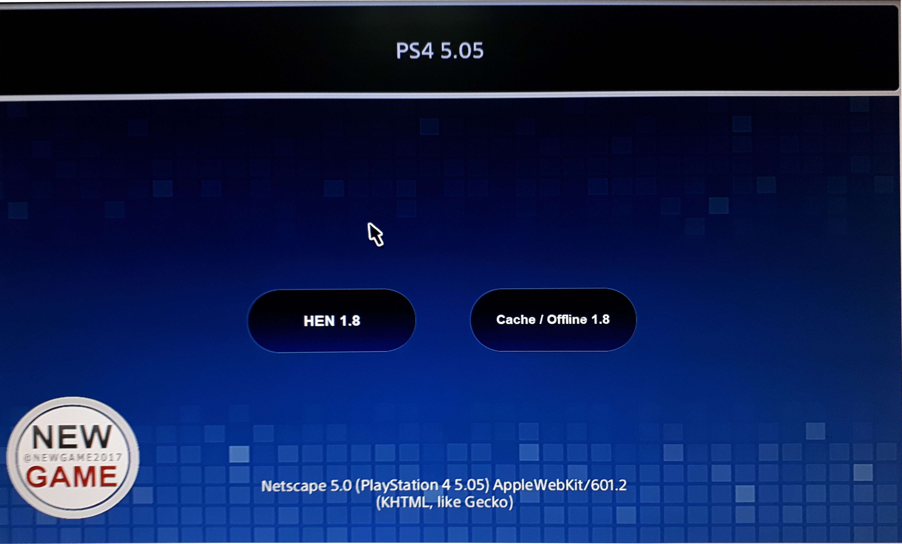

# ESP8266-HEN1.8



## PS4 Host ESP8266 Firmware  for 5.05 HEN 1.8 
* ONLY HEN 1.8 
* Cache
* Payload can be used in offline mode.
* Connect to the Host ESP8266t" and run payloads as usually (browser).

```
* PS4 Wi-Fi Settings
* Network: NEWGAME
* Password: 11111111
```

